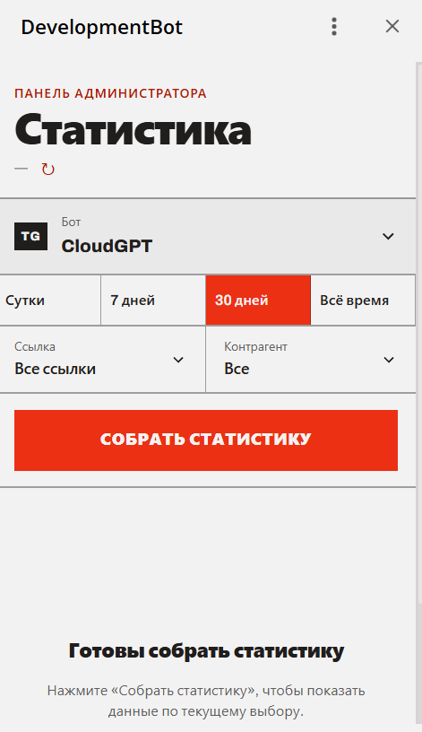
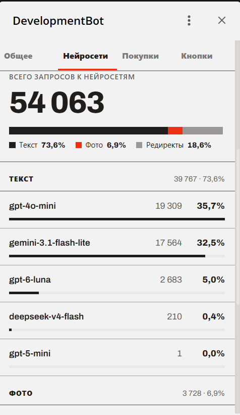
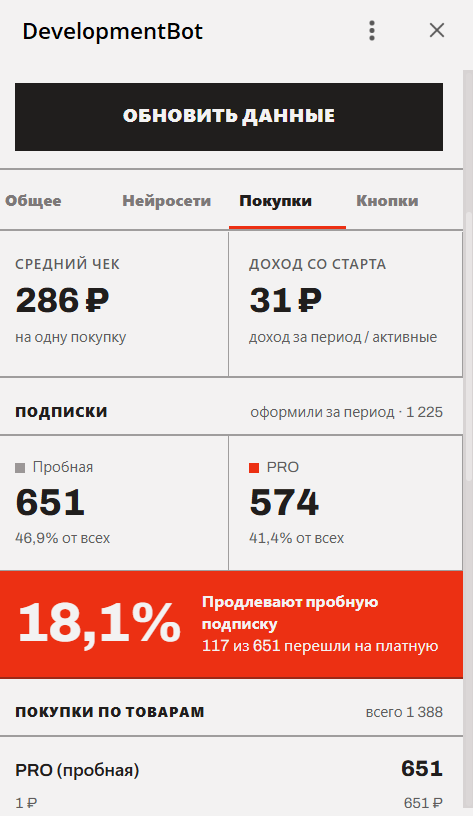
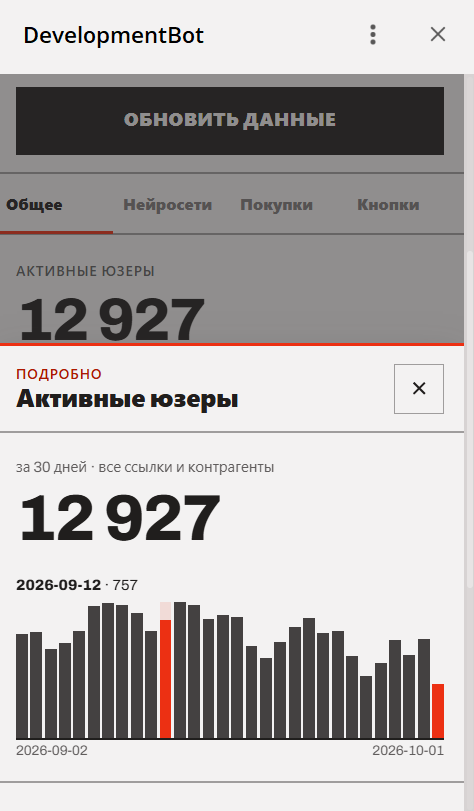

# AI Bots Analytics

Панель аналитики для Telegram-ботов (нейросети/GPT). Показывает статистику по каждому боту:
активность и приток пользователей, запросы к нейросетям, покупки и подписки — с фильтрами
по периоду, реферальным ссылкам и контрагентам. Фронтенд работает как **Telegram Mini App**.

Особенность проекта: один бэкенд обслуживает **множество ботов, у каждого — своя БД**.
Реестр ботов и реквизиты подключения хранятся в основной базе, а статистика считается
«на лету» подключением к БД нужного бота по запросу.

---

## Скриншоты

> Замените плейсхолдеры на реальные скриншоты (положите файлы в `docs/screenshots/`).

| Общее | Нейросети |
| :---: | :---: |
|  |  |

| Покупки | Детализация метрики |
| :---: | :---: |
|  |  |

<!--
Рекомендуемые скриншоты:
  docs/screenshots/general.png  — вкладка «Общее» (активные/новые, рефералы)
  docs/screenshots/ai.png       — вкладка «Нейросети» (топ моделей)
  docs/screenshots/shop.png     — вкладка «Покупки» (чек, подписки, товары)
  docs/screenshots/sheet.png    — нижняя шторка (детализация / выбор фильтра)
  docs/screenshots/filters.png  — фильтры по ссылке и контрагенту
-->

---

## Возможности

- **Пользователи:** активные (уникальные по запросам за период) и новые, с разбивкой по времени
  (сутки — по часам, неделя/месяц — по дням, всё время — равными интервалами).
- **Приток:** новые с Telegram Premium, подписавшиеся на ОП, рефералы по ссылкам и от других
  пользователей — с процентами от новых.
- **Нейросети:** всего запросов и разбивка на текст / фото / редиректы, топ моделей в каждой категории.
- **Покупки:** средний чек, доход на активного пользователя, пробные и PRO-подписки, конверсия
  пробной в платную, топ товаров.
- **Фильтры:** период, реферальная ссылка, контрагент (партнёр).
- **Telegram Mini App:** нативная шапка Telegram, тема, авторизация через `initData`.

---

## Стек

| Слой | Технологии |
| --- | --- |
| Backend | PHP 8.2, Laravel 13, MySQL |
| Frontend | Vue 3, Vite, Telegram Web App SDK |
| Инфраструктура | Docker Compose (nginx + php-fpm + MySQL + Node) |

---

## Архитектура

```
                    ┌─────────────────────────┐
   Telegram  ─────► │  nginx (один домен)      │
                    │   /      → фронт (Vue)    │
                    │   /api/  → Laravel (php)  │
                    └───────────┬─────────────┘
                                │
                    ┌───────────▼─────────────┐        ┌──────────────────┐
                    │  Laravel (backend)       │        │  Основная БД      │
                    │  StatisticsController    │◄──────►│  таблица bots     │
                    │  BotAnalyticsService     │        │  (реестр ботов)   │
                    │  BotDatabase (коннект)   │        └──────────────────┘
                    └───────────┬─────────────┘
                                │ подключение «на лету» по реквизитам из bots
                 ┌──────────────┼───────────────┐
                 ▼              ▼               ▼
          ┌───────────┐  ┌───────────┐   ┌───────────┐
          │ БД бота 1 │  │ БД бота 2 │…  │ БД бота N │   users / query_logs /
          └───────────┘  └───────────┘   └───────────┘   payments / links / partners …
```

- **Основная БД** — только таблица `bots` (имя + host/логин/пароль/имя БД каждого бота).
- **БД бота** — данные конкретного бота (`users`, `query_logs`, `payments`, `links`, `partners`, `op`…).
- `BotDatabase::connect()` создаёт подключение `bot` из реквизитов модели `Bots`;
  `BotAnalyticsService` считает по нему все метрики за период с учётом фильтров.

---

## API

Базовый префикс — `/api`. CSRF отключён, ответы — JSON.

### `GET /api/bots`
Список ботов для селектора.
```json
[{ "id": 1, "name": "tg_hypergpt", "platform": "TG" }]
```

### `GET /api/statistics/filters?bot={id}`
Контрагенты и ссылки конкретного бота (для фильтров).
```json
{
  "contragents": [{ "id": 1, "name": "Telegram Ads" }],
  "links": [{ "id": 5, "name": "tg_ads_sept", "contragent": 1 }]
}
```

### `GET /api/statistics`
Основная статистика.

| Параметр | Тип | Описание |
| --- | --- | --- |
| `time` | int (обяз.) | `1` — сутки, `7` — неделя, `30` — месяц, `0` — всё время |
| `bot` | int (обяз.) | id бота из таблицы `bots` |
| `contragent` | int | фильтр по партнёру (`partners`) |
| `link` | int | фильтр по ссылке (`links`) |

Структура ответа (сокращённо):
```
period      { time, from, to, granularity }
users       { active{total,series[]}, new{total,series[]},
              new_premium{count,percent}, subscribed_op{…},
              from_referral_links{…}, from_other_users{…} }   // percent — от новых
queries     { total, by_type{ text, image, redirect }{count,percent},
              top_models{ text[], image[], redirect[] } }      // percent — от всех запросов
monetization{ purchases, revenue_total, avg_check, revenue_per_active,
              trial_subs{…}, pro_subs{…}, trial_to_pro{…}, top_products[] }
buttons     { total: null, top: null }                         // пока не реализовано
```

---

## Структура проекта

```
ai_bots_analytics/
├── backend/                     # Laravel 13
│   ├── app/
│   │   ├── Http/Controllers/StatisticsController.php
│   │   ├── Http/Requests/StatisticsGetRequest.php
│   │   ├── Models/Bots.php
│   │   └── Services/
│   │       ├── BotAnalyticsService.php   # расчёт метрик
│   │       └── BotDatabase.php           # динамический коннект к БД бота
│   └── routes/api.php
├── frontend/                    # Vue 3 + Vite (Telegram Mini App)
│   └── src/
│       ├── api.js               # обёртка над fetch, читает config.json
│       ├── telegram.js          # инициализация Telegram Web App
│       ├── config.json          # { "apiBase": "/api" }  (в .gitignore)
│       ├── composables/useStats.js   # загрузка данных + маппинг под UI
│       └── components/          # вкладки, графики, нижняя шторка
├── nginx/                       # конфиг nginx
├── php/                         # Dockerfile php-fpm + cron
├── docker-compose.yml.example
└── DEPLOY.md                    # инструкция по деплою
```

---

## Локальная разработка

**Backend**
```bash
cd backend
composer install
cp .env.example .env
php artisan key:generate
# настройте DB_* в .env (основная БД с таблицей bots)
php artisan migrate
php artisan serve            # http://localhost:8000
```

**Frontend**
```bash
cd frontend
npm install
cp src/config.example.json src/config.json    # { "apiBase": "/api" }
npm run dev                  # http://localhost:5173
```
В dev-режиме Vite проксирует `/api` на `http://localhost:8000`
(переопределяется переменной `VITE_API_PROXY`).

---

## Деплой

Полная инструкция по запуску на сервере (Docker, hosting в поддиректории за существующим
nginx, Telegram) — в [**DEPLOY.md**](DEPLOY.md).

В эталонном деплое проект живёт на общем домене под префиксом `/statistics/`:
фронт — `https://api.gptbackend.ru/statistics/`, API — `https://api.gptbackend.ru/statistics/api/...`
(хостовый nginx срезает `/statistics`, внутри роуты Laravel остаются `/api/*`).
Базовый путь фронта задаётся в `vite.config.js` (`base`), адрес API — в `frontend/src/config.json`.

---

## Особенности реализации

- **Активные пользователи** считаются как уникальные `user_id` из `query_logs` за период.
- **Пробная подписка** определяется по `payments.summ == 1`, остальное — платная PRO.
- **«Подписались на ОП»** — новые пользователи, не пропустившие обязательную подписку
  (без ссылки с `links.skip_op = 1`); при появлении отдельного признака легко заменить.
- **Дельты** («изменение к прошлому периоду») в UI не показываются — бэкенд их не считает.
- **Вкладка «Кнопки»** отдаёт `null` (нет данных в БД) — фронт готов принять их без изменений.
- Часовой пояс расчётов — **Europe/Moscow**.
